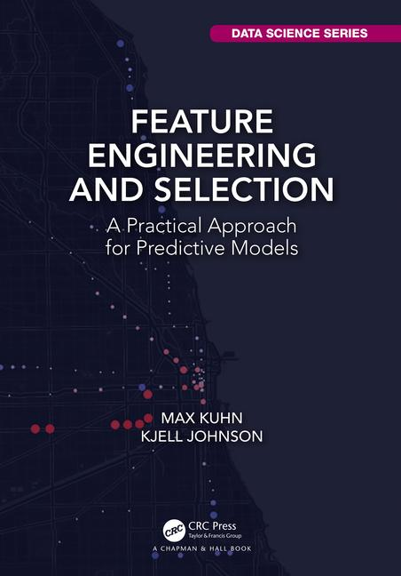

Code and Data Sets for [_Feature Engineering and Selection_](https://bookdown.org/max/FES/) by Max Kuhn and Kjell Johnson (2019). 

[Link to buy on Amazon](https://www.amazon.com/gp/product/1138079227/ref=as_li_tl?ie=UTF8&tag=apm0a-20&camp=1789&creative=9325&linkCode=as2&creativeASIN=1138079227&linkId=c801e78acfc3bc022dbed02af4851962)

[Link to buy from CRC Press](https://www.crcpress.com/Feature-Engineering-and-Selection-A-Practical-Approach-for-Predictive-Models/Kuhn-Johnson/p/book/9781138079229)

The repo currently contains:

* A [venue to ask questions or make comments](https://github.com/topepo/FES/issues) about the book. Please help us make it better!
* `Data_Sets` directory contains all of the new data sets used in the text. 
* Other directories contain code that reproduces the analyses in the book. Some analyses are contained in since subdirectories or files while others are split up (as is best for each case). Each analysis has a list of required R packages and enumerates the package versions that were used for the analyses contained in the text. Most analyses use visualizations and tables that are consistent with the on-line version and are interactive where possible. 

(there is no code for chapter 10)

For questions or comments, please [file an issue](https://github.com/topepo/FES/issues).  